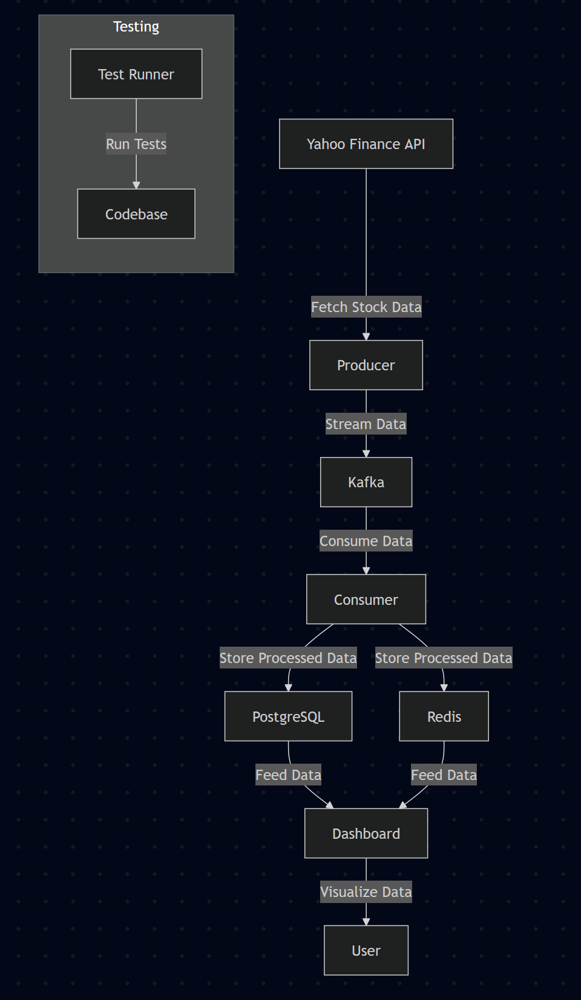

# 📈 Real-Time Stock Analyzer

A production-ready, modular real-time stock analyzer tool using Yahoo Finance, Kafka, Docker, and Python.  
Analyze rolling month volatility and discover stocks with similar risk profiles (clusters) in real time! 🚀

---

## 📝 Table of Contents

- [Features](#features)
- [Architecture](#architecture)
- [Prerequisites](#prerequisites)
- [Quickstart](#quickstart)
- [Usage](#usage)
- [Testing](#testing)
- [Project Structure](#project-structure)
- [Production Deployment](#production-deployment)

---

## ✨ Features

- 🔄 Streams rolling 3-month stock data from Yahoo Finance
- ⚡ Real-time data pipeline with Kafka
- 📊 Volatility analysis and similarity detection
- 🐳 Runs anywhere with Docker & Docker Compose
- 🛠️ Modular, testable, and extensible Python code
- ☁️ Ready for cloud deployment (Azure, AWS, GCP)

---

## 🏗️ Architecture

The Real-Time Stock Analyzer is built on a microservices architecture. Below is an overview of the key components:

### Key Components:
1. **Producer**: Fetches stock data from Yahoo Finance and streams it to Kafka.
2. **Kafka**: Acts as the message broker for real-time data streaming.
3. **Consumer**: Processes stock data from Kafka and performs volatility analysis.
4. **PostgreSQL**: Stores processed stock data for historical analysis.
5. **Redis**: Caches stock updates for quick access by the dashboard.
6. **Dashboard**: A Streamlit-based web interface for visualizing stock data.
7. **Test Runner**: Runs automated tests and generates coverage reports.

### Architectural Diagram



---

## 🏗️ Architecture

The Real-Time Stock Analyzer is built on a microservices architecture. Below is an overview of the key components:

### Key Components:
1. **Producer**: Fetches stock data from Yahoo Finance and streams it to Kafka.
2. **Kafka**: Acts as the message broker for real-time data streaming.
3. **Consumer**: Processes stock data from Kafka and performs volatility analysis.
4. **PostgreSQL**: Stores processed stock data for historical analysis.
5. **Redis**: Caches stock updates for quick access by the dashboard.
6. **Dashboard**: A Streamlit-based web interface for visualizing stock data.
7. **Test Runner**: Runs automated tests and generates coverage reports.

---

## ⚙️ Prerequisites

- [Docker](https://www.docker.com/) & [Docker Compose](https://docs.docker.com/compose/)
- (Optional) [Python 3.8+](https://www.python.org/) for running tests locally

---

## 🚀 Quickstart

1. **Clone the repository**
   ```bash
   git clone https://github.com/svm9000/realtime-stock-analyzer.git
   cd realtime-stock-analyzer
   ```

2. **Configure environment variables**
   - Copy `.env` and edit as needed (symbols, window, log level, etc.).

3. **Build and start the stack**
   ```bash
   docker-compose up --build
   ```

4. **Access the dashboard**
   - Open your browser and navigate to `http://localhost:8501`.

---

## 🛠️ Usage

- Edit `.env` to change stock symbols, window, or log level.
- Logs and analysis output will be shown in the console.
- All configuration is managed via the `.env` file.

---

## 🧪 Testing

Run tests locally (requires Python 3.8+):
```bash
pip install -r requirements.txt
pytest tests/
```

To run tests in Docker:
```bash
docker-compose run testrunner
```

---

## 📂 Project Structure

```
├── docker/                  # Dockerfiles for services
│   ├── producer/            # Producer service
│   ├── consumer/            # Consumer service
│   ├── dashboard/           # Dashboard service
│   ├── tests/                # Test runner service
├── src/                     # Application source code
├── tests/                   # Unit and integration tests
├── docker-compose.yml       # Docker Compose configuration
└── README.md                # Project documentation
```

---

## ☁️ Production Deployment

### Azure

- Deploy as a container group or use Azure Kubernetes Service (AKS).
- Use [Azure Event Hubs](https://azure.microsoft.com/en-us/products/event-hubs/) as a managed Kafka endpoint.
- Store secrets and configs in [Azure Key Vault](https://azure.microsoft.com/en-us/products/key-vault/).
- Use [Azure Container Registry](https://azure.microsoft.com/en-us/products/container-registry/) for image storage.
- Set up monitoring with [Azure Monitor](https://azure.microsoft.com/en-us/services/monitor/).

### AWS

- Deploy with [Amazon ECS](https://aws.amazon.com/ecs/) or [EKS](https://aws.amazon.com/eks/).
- Use [Amazon MSK](https://aws.amazon.com/msk/) for managed Kafka.
- Store configs in [AWS Secrets Manager](https://aws.amazon.com/secrets-manager/) or [SSM Parameter Store](https://aws.amazon.com/systems-manager/parameter-store/).
- Use [ECR](https://aws.amazon.com/ecr/) for Docker images.
- Set up monitoring with [CloudWatch](https://aws.amazon.com/cloudwatch/).

### GCP

- Deploy with [Google Kubernetes Engine (GKE)](https://cloud.google.com/kubernetes-engine).
- Use [Cloud Pub/Sub](https://cloud.google.com/pubsub) or [Confluent Cloud](https://www.confluent.io/) for managed Kafka.
- Store configs in [Secret Manager](https://cloud.google.com/secret-manager).
- Use [Artifact Registry](https://cloud.google.com/artifact-registry) for Docker images.
- Set up monitoring with [Operations Suite (Stackdriver)](https://cloud.google.com/products/operations).

**General Production Tips:**
- Use managed Kafka services for scalability and reliability.
- Set up monitoring/logging with cloud-native tools.
- Use CI/CD pipelines for automated builds and deployments.
- Secure environment variables and secrets.
- Scale using orchestration (Kubernetes, Docker Swarm, etc.).
- Use rolling updates and health checks for zero-downtime deployments.

